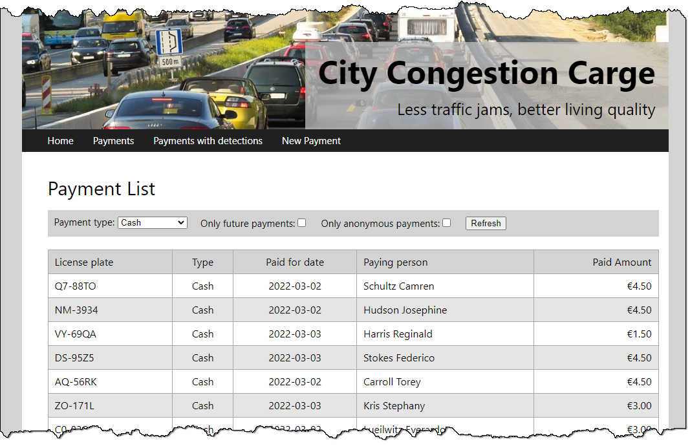
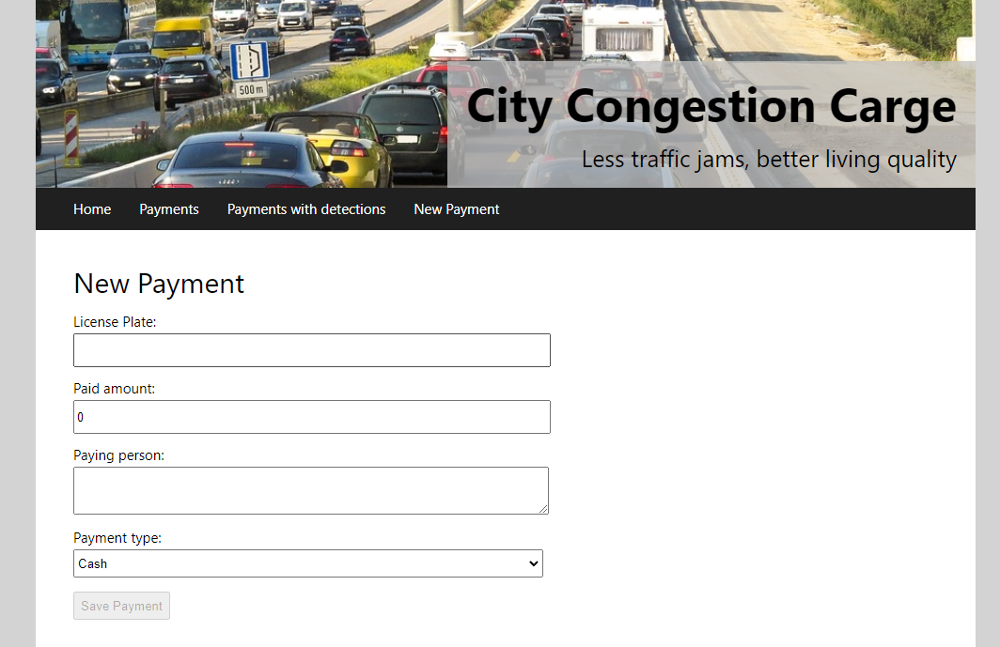

# City Congestion Charge (CCC) - Web

## Introduction

This exercise is part of the larger [*City Congestion Charge* (CCC) sample](..). Make yourself familiar with the business requirements before starting this exercise.

In this exercise, you have to implement RESTful web APIs and an Angular UI.

## Starter Solution

This folder contains a starter solution that you have to extend. The CCC data model has already been implemented for you (see [*DataModel.cs*](CityCongestionCharge.Data/DataModel.cs)). Make yourself familiar with it.

The starter solution also contains skeletons for the RESTful Web API ([*CityCongestionCharge.Api*](CityCongestionCharge.Api)) and the Angular UI ([*CityCongestionCharge.Web*](CityCongestionCharge.Web)). The Angular skeleton already contains most of the HTML structures and styles. However, it does not contain any logic or *data bindings*. Before moving on, make yourself familiar with the skeletons.

**Note that you have to regenerate the CCC database if you have already done [the WPF](../part-2-wpf) or [the unit-testing part](../part-1-unit-testing/) before**. The reason is that one class has been extended a little bit. The demo data generator you know from the [the WPF](CityCongestionCharge.DesktopUI/) part already has also been adjusted.

## Your Job

**Complete** the RESTful Web API and the Angular UI based on the requirements in the existing skeleton apps. You have to work on the following functions:

### Web API

An external company will deliver master data about the cars. For that, they need a RESTful web API used during import. Your job is to implement this *RESTful Web API*.

The starter solution already contains a skeleton for the *API Controller* ([*CarsController*](CityCongestionCharge.Api/Controllers/CarsController.cs)). Implement the API methods `GetCars`, `AddCar`, `PatchCar`, `GetCarById` and `DeleteCarById` corresponding to the code documentation. You can test your API with the *Swagger UI* already included in the skeleton project.

### Web UI

The team responsible for charging customers needs a web UI for payment management. You have to implement an Angular app for that.

The starter solution already contains a [skeleton for the *Angular UI*](CityCongestionCarge.Web/). It already contains most of the HTML structures and styles. However, it does not contain any logic or *data bindings*.

**Your job**: Complete the payment management corresponding to the requirements in the code documentation of the web UI. You have to implement the following functions:

* List all payments, that have at least on car detection on the *paid-for-date* (see `GetPaymentsWithDetections` in [*PaymentsController*](CityCongestionCharge.Api/Controllers/PaymentsController.cs)). To do that, complete the Angular component [`payments-with-detections`](CityCongestionCharge.Web/src/app/payments-with-detections).

  

* List all payments with optional filter conditions (see `GetPayments` in [*PaymentsController*](CityCongestionCharge.Api/Controllers/PaymentsController.cs)). To do that, complete the Angular component [`payments`](CityCongestionCharge.Web/src/app/payments). If possible, don't display `PaymentType` as a number, but display it as a text (e.g. *Cash*, *Credit card* etc.).

  

* Possibility to add a new payment (see `AddPayment` in [*PaymentsController*](CityCongestionCharge.Api/Controllers/PaymentsController.cs)). To do that, complete the Angular component [`new-payment`](CityCongestionCharge.Web/src/app/new-payment).

  
  
## Tips

* If you struggle with the filtered list, implement the unfiltered list first.
