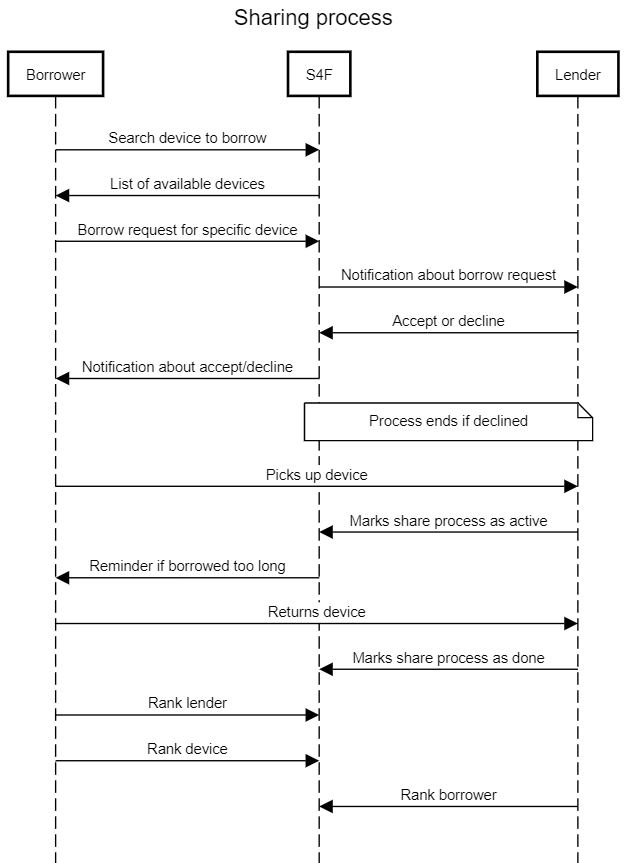

# Data Access Exercise

## Introduction

In this exercise, you have to build a *Data Access Layer* using *C#*, *.NET 6*, *Entity Framework Core 6*, and *Microsoft SQL Server*. You have to derive the data model from the following fictitious case study.

Technically, you have to build an *ASP.NET Core 6 Minimal API* project that includes *Entity Framework Core 6*. You do **not** have to implement the web APIs. You just have to design and implement the data model classes, the Entity Framework data context, and the migrations. Your project must be able to successfully create the table structure in a corresponding SQL Server database.

## General Description

The customer is a large non-profit organization that would like to contribute to reducing the CO2-footprint of people by promoting the concept of a [*sharing economy*](https://en.wikipedia.org/wiki/Sharing_economy). The codename of the project is *Share for Future* (short: *S4F*).

S4F will be a platform through which people can borrow devices from other people. It focusses on consumers, not professional tool rental companies. The primary goal is to bring together people who live near to each other (e.g. neighbors, people living in the same city). This should make logistics easier and ensure a certain level of base trust between people.

Let's look at a typical scenario in which S4F could be helpful: Tom lives in a small flat. He is not a do-it-yourself enthusiast. However, he recently bought a new ceiling lamp and now he needs to mount it. Unfortunately, Tom does not own a decent drilling machine that could drill a hole into his flat's concrete ceiling. Eve lives a few blocks away from Tom. Eve is a passionate home improver and of course she owns a top-notch drilling machine. Although Eve regularly does do-it-yourself projects, she does not need the drilling machine every day. So she decides to offer it through S4F. Tom decides to use S4F to look for somebody in his neighborhood with proper tools. S4F brings Tom and Eve together. Tom gets the drilling machine from Eve and can successfully mount his lamp. After his project, Tom returns the machine and some "thank you" chocolate to Eve. Eve is happy that she could help, Tom is happy because he has a new lamp in his flat.

## Requirements

### Users

S4F must store a list of users. For each user, S4F must store basic personal data like name fields and physical address.

For each user, S4F must store a contact email address. The email address must be globally unique (i.e. there must not be two users with the same email address in the S4F database). The platform will contain mechanisms to validate contact email addresses (e.g. by sending an email to the user with a link on which to click to validate the email address). Therefore, S4F must store when the contact data was last verified.

S4F does not store user names and passwords. The system relies on external identity providers (Google, Microsoft, and Facebook). Every user can associate her account with 1..many identities (e.g. one user could sign in with her Google or her Facebook account). For each identity, S4F needs to store the identity provider and the technical user ID of the corresponding identity provider.

S4F wants to be able to send reminder emails to users who have not logged in to S4F for a long time. The S4F database must be able to store the necessary data to enable that feature.

Users who are S4F employees are marked in the database. They can belong to one of the following user groups:

* Regular S4F employee
* Manager
* System administrator

### Offerings

Every user can offer 0..many devices for sharing. For each device, S4F must store basic description data including title, description, condition (like new, used, heavily used, to be repaired) and 0..many images of the device. S4F wants to be able to send out regular (e.g. every month) reminder emails to people offering devices asking whether the data about the device is still valid. The S4F database must be able to store the necessary data to enable that feature.

S4F contains a list of device categories. Each category consists of a list of subcategories. Each device must be assigned to a subcategory.

Users offering devices can assign 0..many *tags* to each device. A tag is just a text property. Tags will be taken into account when people look for offerings in the S4F platform.

Users can mark devices that they offer as *currently available* or *currently unavailable*. S4F wants to be able to send reminder emails to users who have marked a device as *currently unavailable* for a long time. The S4F database must be able to store the necessary data to enable that feature.

Users can store periods of time through which a device will not be available (e.g. if the lender needs the device on their own for a planned home improvement project).

### Sharing

Important terms regarding sharing process:

* *Borrower*: The user who wants to borrow a device.

* *Lender*: The user who owns a device and want to share it.

The sharing process works like this:

* If a user finds a device she wants to borrow, she can enter the period of time through which she would like to have the tool.

* S4F will send a notification email about the borrow request to the lender of the device. S4F wants to be able to send reminder emails to lenders if they do not respond within 48 hours.

* The lender can accept or decline the borrow request. In both cases, the lender can add a message (e.g. greeting, reason why declined). The borrower receives a corresponding notification email.
  
* If the lender has declined, the sharing process ends here.

* The lender can mark the share as *active* once the borrower picked the device up. S4F needs to record the time when the share becomes active.

* When the borrower returns the device, the lender marks the share as *done*. S4F needs to record the time when the share is done. S4F wants to be able to send reminder emails to borrowers if the planned end date of the share has been reached but the share isn't marked as *done*.

* After a share has been done, the lender can rank the borrower with 0..5 stars. The borrower can rank the lender with 0..5 stars. The borrower can also rank the device with 0..5 stars. Both users can add a textual note to rankings (e.g. reason why to many stars).

The S4F database must be able to store the necessary data to enable the process described above.



```flow
# See https://sequencediagram.org/
title Sharing process

Borrower->S4F:Search device to borrow
Borrower<-S4F:List of available devices
Borrower->S4F:Borrow request for specific device
S4F->Lender:Notification about borrow request
S4F<-Lender:Accept or decline
Borrower<-S4F:Notification about accept/decline
note over S4F,Lender:Process ends if declined
Borrower->Lender:Picks up device
S4F<-Lender:Marks share process as active
S4F->Borrower:Reminder if borrowed too long
Borrower->Lender:Returns device
S4F<-Lender:Marks share process as done
Borrower->S4F:Rank lender
Borrower->S4F:Rank device
Lender->S4F:Rank borrower
```

### Complaints

Users can file complaints about other users (e.g. borrower did return the borrowed device broken).

S4F employees will try to settle the complaints. When a complaint comes in, a S4F manager assigns it to an S4F employee who will be responsible for the complaint. Both involved users and the assigned S4F employee can store notes (text, pictures) to the complaint. The S4F employee can mark the complaint as *done* once it will have been settled.

S4F wants to be able to generate statics about the duration of complaints. The S4F database must be able to store the necessary data to enable that feature.
