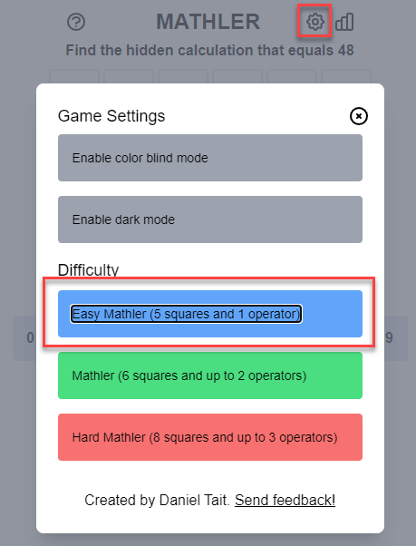
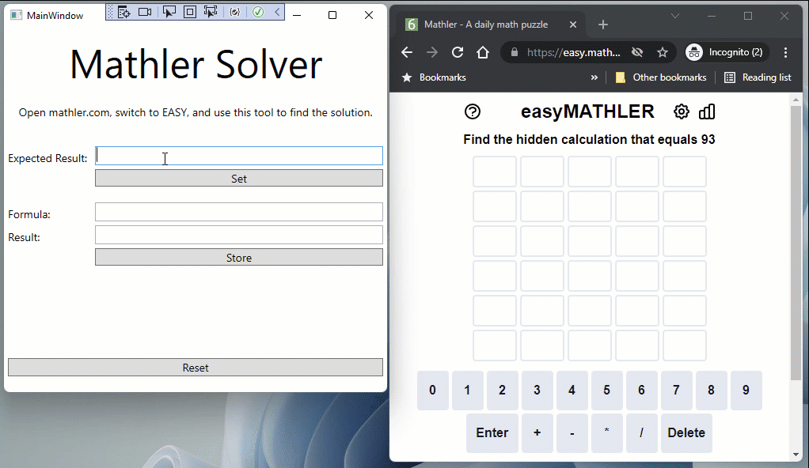

# Mathler Solver

## Introduction

Word and number guessing games are currently quite popular (e.g. [wordle](https://wordlegame.org/de), [nerdle](https://nerdlegame.com/)). Your job is to implement a solver tool for [mathler](https://www.mathler.com/). Because of the limited time that you have for this exercise, we focus on *easy mathler*:

This is how your final app should look like and work in combination with the *mathler* website:

## Requirements

### Business Logic

* Start with the given [StarterSolution](StarterSolution).
* Complete the business logic in [PuzzleSolver.cs](StarterSolution/Mathler.Solver/PuzzleSolver.cs).
  * Come up with a decent business logic for generating meaningful guesses. If this was an exam, the quality of your guessing algorithm would influence your grade.
* Make sure that the unit tests in [PuzzleSolverTests.cs](StarterSolution\Mathler.Solver.Tests\PuzzleSolverTests.cs) are all green. Add at least two meaningful unit tests.

### WPF UI

* Complete the UI and view logic in [MainWindow.xaml](StarterSolution/Mathler.WpfUI/MainWindow.xaml) and [MainWindow.xaml.cs](StarterSolution/Mathler.WpfUI/MainWindow.xaml.cs).
  * Note that at first, only setting of the expected result is enabled. The rest of the UI is disabled.
  * After setting the result, the rest of the UI is enabled.
* Make sure that the app works as shown in the animation above.

## Sample Solution

Once your are done, compare your solution with the given [SampleSolution](SampleSolution). Did you find a better one?
